  

  

  
  
  
  
  

  
  
  

---

## ⚡ About me

🚀 &nbsp;**Software Engineer at [Evidano](https://evidano.com)** — contract, remote

💻 &nbsp;I build web applications end to end: interface, API, database, deployment

📦 &nbsp;**30+ projects** shipped · 22 written up with full case studies

🎓 &nbsp;BCA from Punjab University · pursuing MCA at IGNOU

🌱 &nbsp;Currently going deeper on **TypeScript** and **AWS**

🤝 &nbsp;Open to collaborating on **Next.js**, **React** and **Node**

📍 &nbsp;Chandigarh, India — happy to work remote

 

---

## 🛠️ Tech stack

  

---

## 🚀 Featured projects

<table>
  <tr>
    <td width="50%" valign="top">
      <h3>🏥 Clinic Care</h3>
      
Healthcare platform — doctor appointments, treatment tracking and PhonePe payments.

      

        
        
      

      
      
    </td>
    <td width="50%" valign="top">
      <h3>💸 Dhanapatha</h3>
      
Money transfer app — Stripe payments, wallets, transfers, transaction history, refunds.

      

        
        
      

      
      
    </td>
  </tr>
  <tr>
    <td width="50%" valign="top">
      <h3>🍽️ SD Canteen</h3>
      
College e-canteen — online ordering, advance orders, special offers, ratings.

      

        
        
      

      
      
    </td>
    <td width="50%" valign="top">
      <h3>📝 NoteShareHub</h3>
      
Cloud notes with Google login, search, privacy controls and real-time updates.

      

        
        
      

      
      
    </td>
  </tr>
  <tr>
    <td width="50%" valign="top">
      <h3>📋 Co Activity Manager</h3>
      
Tracks student evening-activity records and fees for a college.

      

        
        
      

      
      
    </td>
    <td width="50%" valign="top">
      <h3>💬 Live Chat</h3>
      
Account-free chat rooms with private spaces, built on sockets.

      

        
        
      

      
      
    </td>
  </tr>
</table>

  

---

## ✍️ Latest blog posts

<!-- BLOG-POST-LIST:START -->
<!-- Refreshed daily by .github/workflows/blog-posts.yml -->
<!-- BLOG-POST-LIST:END -->

<a href="https://surajsinghgore.hashnode.dev">→ more on Hashnode</a>

---

## 📊 GitHub stats

  

  
  

  

  

---

## 🐍 Watch the snake eat my contributions

<picture>
  <source media="(prefers-color-scheme: dark)" srcset="https://raw.githubusercontent.com/surajsinghgore/surajsinghgore/output/snake-dark.svg" />
  <source media="(prefers-color-scheme: light)" srcset="https://raw.githubusercontent.com/surajsinghgore/surajsinghgore/output/snake.svg" />
  
</picture>

---

## 🌐 Find me elsewhere

  
  
  
  
  
  
  

---

  

